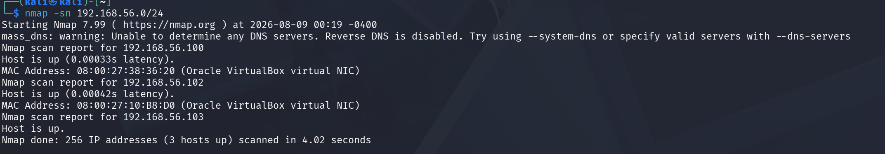
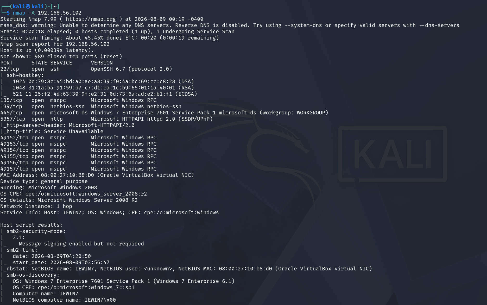
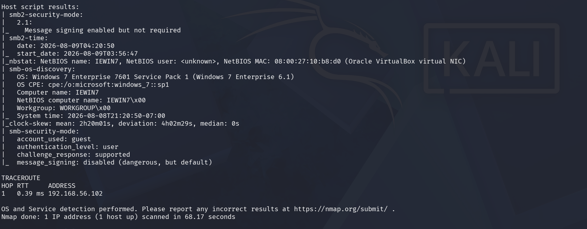

# Windows 7 — MS17-010 (EternalBlue) Exploitation

**Target:** Windows 7 (`IEWIN7`) · `192.168.56.102`
**Attacker:** Kali Linux · `192.168.56.103`
**Network:** Isolated VirtualBox host-only network `192.168.56.0/24`, no internet route
**Vulnerability:** MS17-010 / CVE-2017-0144 — SMBv1 Remote Code Execution

> **Authorization.** All testing was performed against a virtual machine I built and own, on an isolated network with no route to the internet or any external system. This is a personal lab set up for the purpose of learning penetration testing.

---

## 1. Executive Summary

A full vulnerability assessment was conducted against a Windows 7 SP1 host in an isolated lab. The host presented the classic surface profile of an MS17-010 (EternalBlue) target — Windows 7 with SMB exposed — but direct testing confirmed it was **not exploitable via MS17-010 because SMBv1 is disabled**, a correct hardening measure. Reconnaissance did identify a real weakness in disabled SMB signing, and the host's end-of-life status is a standing risk. The engagement demonstrates a complete assessment methodology: enumeration, targeted vulnerability testing, and — importantly — investigating *why* a negative result occurred rather than accepting it at face value.

---

## 2. Scope & Environment Setup

The lab consists of two virtual machines on an isolated VirtualBox host-only network (`192.168.56.0/24`) with no gateway and no internet access.

| Machine | Role | IP |
| ------- | ---- | -- |
| Kali Linux | Attacker | 192.168.56.103 |
| Windows 7 (IEWIN7) | Target | 192.168.56.102 |

_(Note during testing: the Windows host firewall initially blocked SMB, and a host-only adapter mismatch initially prevented layer-3 connectivity between the VMs. Both were resolved before assessment — documented in the reconnaissance notes below.)_

---

## 3. Reconnaissance

### 3.1 Host Discovery

**Command:**
```bash
nmap -sn 192.168.56.0/24
```

**Result:** Three live hosts on the isolated network — the adapter (`192.168.56.100`), the Windows 7 target (`192.168.56.102`), and the Kali attacker (`192.168.56.103`).



### 3.2 Aggressive Service, Version & OS Scan

An aggressive scan (`-A`) was run against the target to enumerate all services, versions, and the operating system without prior assumptions about what was running.

**Command:**
```bash
nmap -A 192.168.56.102
```

**Key results:**

| Port | Service | Detail |
| ---- | ------- | ------ |
| 22/tcp | OpenSSH 6.7 | Non-native — SSH was installed on the host |
| 135/tcp | msrpc | Microsoft Windows RPC |
| 139/tcp | netbios-ssn | NetBIOS session service |
| 445/tcp | microsoft-ds | **Windows 7 Enterprise 7601 SP1** — SMB |
| 5357/tcp | http | Microsoft HTTPAPI 2.0 (UPnP) |
| 49152–49157 | msrpc | Dynamic RPC ports |

**Operating system:** `smb-os-discovery` confirmed **Windows 7 Enterprise 7601 Service Pack 1**, computer name `IEWIN7`, workgroup `WORKGROUP`. Nmap's TCP/IP OS detection guessed Server 2008 R2, but the SMB banner is authoritative — Windows 7 and Server 2008 R2 share a kernel and fingerprint similarly, so the SMB script result was taken as correct.



**Additional observation — weak SMB configuration.** The scan flagged `message_signing: disabled (dangerous, but default)` and `Message signing enabled but not required`. Disabled/optional SMB signing exposes the host to SMB relay attacks, independent of the RCE vulnerability assessed below.



---

## 4. Vulnerability Identification

The target runs Windows 7 SP1 with SMB exposed, which is the classic fingerprint for MS17-010 (EternalBlue). This was tested directly.

**Commands:**
```bash
nmap -p 445 --script smb-vuln-ms17-010 -Pn 192.168.56.102
```
```
msf6 > use auxiliary/scanner/smb/smb_ms17_010
msf6 > set RHOSTS 192.168.56.102
msf6 > run
```

**Result:** Both Nmap and Metasploit reported the host as **not vulnerable**. Notably, the Nmap script returned *no verdict section at all* — not a NOT_VULNERABLE result, but no result — which indicated the check could not complete its SMBv1 negotiation. This pointed to **SMBv1 being disabled on the host** rather than the MS17-010 patch being present.

**Finding:** The target is **not exploitable via MS17-010 because SMBv1 is disabled**. This is the correct, recommended hardening posture — SMBv1 is a deprecated protocol that Microsoft advises disabling precisely to prevent this class of attack. A hardened target producing a negative result is a valid and important assessment outcome.

### Why this matters (analysis)

Distinguishing between these three cases is a core assessment skill:

| Check result | Meaning |
| ------------ | ------- |
| Script prints `NOT VULNERABLE` | SMBv1 is running, but the MS17-010 patch is installed |
| Script prints `VULNERABLE` | SMBv1 running and unpatched — exploitable |
| Script prints **no verdict** | SMBv1 not negotiable (disabled) — the case here |

Accepting the first "not vulnerable" at face value would have been a mistake; investigating *why* the check failed is what separates a real assessment from running a tool.

---

## 5. Additional Findings

Independent of MS17-010, reconnaissance surfaced a genuine weakness:

**SMB signing disabled.** The scan reported `message_signing: disabled (dangerous, but default)`. When SMB signing is not required, the host is exposed to **SMB relay attacks**, where an attacker relays authentication to another service to gain access. This is a real, reportable finding on this host regardless of the MS17-010 result.

---

## 6. Remediation

| Issue | Recommendation |
| ----- | -------------- |
| Legacy OS | Windows 7 is end-of-life and unsupported; migrate to a supported OS |
| SMBv1 (already disabled here) | Keep SMBv1 disabled across all hosts; this is what protected the target from MS17-010 |
| SMB signing disabled | Enable and require SMB signing to prevent relay attacks |
| Unnecessary exposed services | Review the exposed OpenSSH and UPnP services; disable if not required |

---

## 7. MITRE ATT&CK Mapping

| Tactic | Technique | Where |
| ------ | --------- | ----- |
| Reconnaissance | Active Scanning (T1595) | Host discovery, `-A` scan |
| Discovery | Network Service Discovery (T1046) | Service and version enumeration |
| Discovery | System Information Discovery (T1082) | OS fingerprinting via SMB |

---

## 8. Conclusion

The Windows 7 target was fully enumerated. While it presented the surface profile of an MS17-010-vulnerable host, direct testing showed it was **not exploitable via EternalBlue because SMBv1 was disabled** — a correct hardening measure. The assessment did identify a real weakness in disabled SMB signing, and the host's end-of-life status remains a standing risk. The key takeaway from this engagement was methodological: a negative vulnerability result was investigated rather than accepted, correctly distinguishing a disabled protocol from an installed patch.

_Note: This write-up documents an honest assessment outcome. Exploitation of MS17-010 requires SMBv1, which this hardened image does not expose._

---
